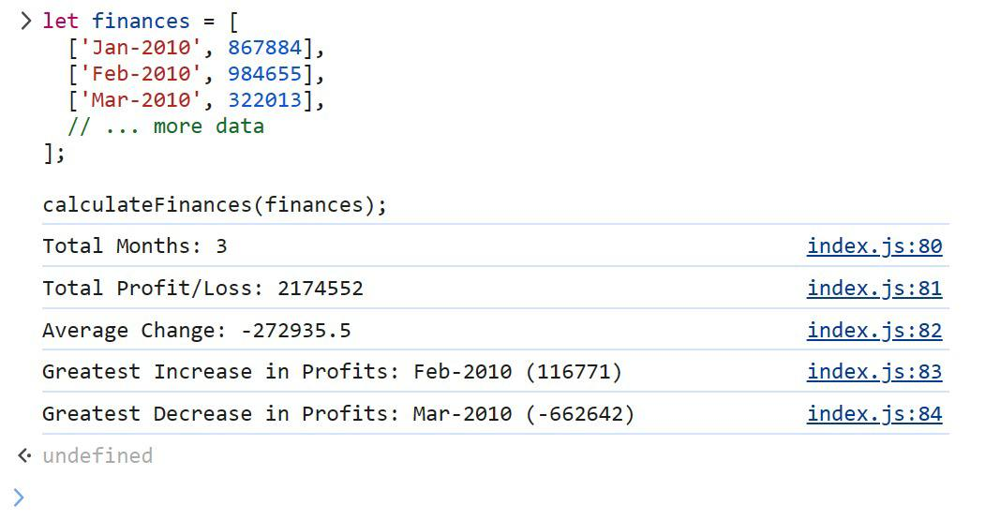

# Console-Finances
JavaScript code that analyzes the records to calculate each of the following:  The total number of months included in the dataset.  The net total amount of Profit/Losses over the entire period.  The average of the changes in Profit/Losses over the entire period. 
## Unit 4 Challenge: Console Finances

In this challenge, I will be using my JavaScript skills to analyze the financial records of a company. The activity presents a real-world situation where I'll be tasked with creating code to analyze a financial dataset provided in the starter/index.js file. I'll be applying the concepts I've learned throughout the course to complete the required activity. This challenge will help me develop my skills in using JavaScript to solve real-world problems, and will give me valuable experience in working with financial data.

